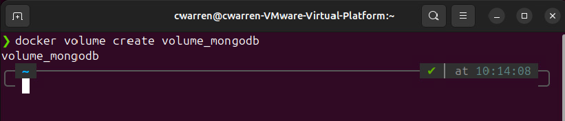
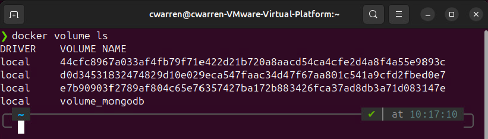
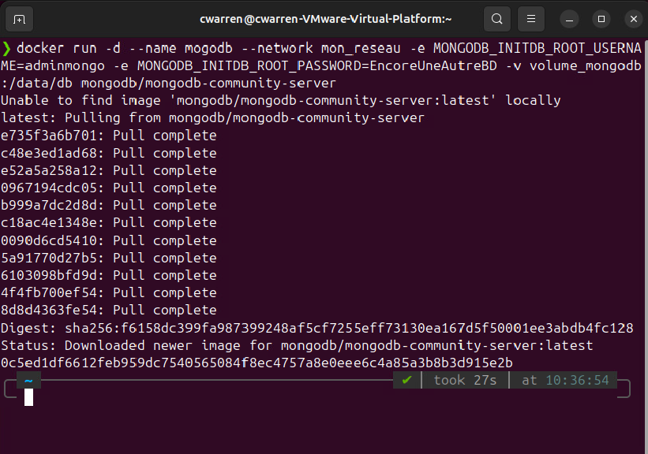
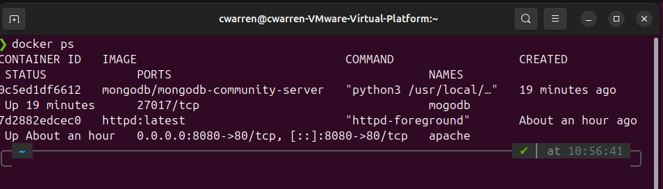
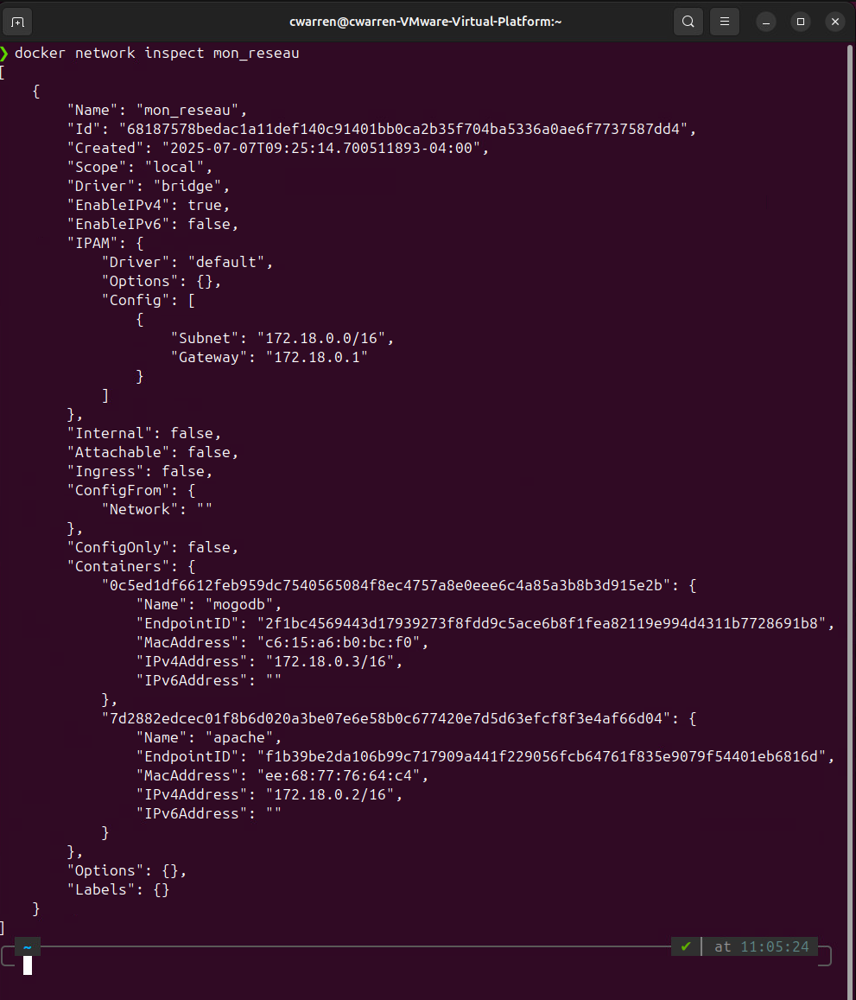
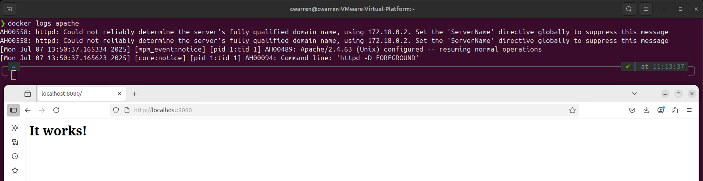

# ISS_TP2_Docker

## Date : `06-07-2025`
## Auteur : `Charles-Philippe Warren`
## Contexte : `Création d'un conteneur à partir d'un descriptif et installation d'un système de conteneurs.`

## Objectifs

    Analyser les différents scénarios de déploiement proposés dans les documents de conception.
    Distinguer correctement les services à installer sur les serveurs.
    Distinguer correctement les services à installer sur le réseau.
    Déterminer un plan des étapes à entreprendre pour installer et configurer les services réseau
    Configurer le système d’exploitation après l’installation.
    Installer des périphériques/composantes pour une connectivité au réseau.
    Configurer des périphériques / composantes pour une connectivité au réseau.
    Utiliser des protocoles sécuritaires.

### Réalisation: 
    Installation d'un système de conteneur selon la procédure et les recommandations du manufacturier;
    Configuration d'un système de conteneurs sécuritaire;
    Vérification du bon fonctionnent de chaque éléments du système de conteneurs;
    Configuration des règles de gestions et d'accès.

# Section 1 : Vérification et conteneurs

## Étape 1: Vérification de l’installation
    Après installation de docker et docker compose ouvrir un terminal bash et faire les commandes suivantes afin de valider si l'installation est conforme: 

    Vérification de la version installée de Docker:
```bash
    docker --version
```
---

---
    Vérification de la version installée de Docker Compose:
```bash
    docker compose version
```
---

---

## Étape 2 : Création de conteneurs sur le poste local
    Créer un réseau virtuel privé Docker appellé : mon_reseau.
```bash
    docker network create mon_reseau
```
---

---
    Vérification de la création du réseau viturel privé
```bash
    docker network ls
```
---

---
    Créer un conteneur Appache à partir de l'image http:latest
```bash
    docker run -d --name apache --network mon_reseau -p 8080:80 httpd:latest
```
---

---
    Vérification de la création du conteneur apache
```bash
    docker ps
```
---

---
    Créer un Volume Docker pour MongoDb. Celui-ci est nécessaire pour conserver les données de la base de données.
```bash
    docker volume create volume_mongodb
```
---

---
    Vérification de la création du volume.
```bash
    docker volume ls
```    
---

---
    Créer un conteneur MongoDB connecté au réseau mon_reseau et qui utilise le volume volume_mongodb
```bash
    docker run -d --name mogodb --network mon_reseau -e MONGO_INITDB_ROOT_USERNAME=adminmongo -e MONGO_INITDB_ROOT_PASSWORD=EncoreUneAutreBD -v volume_mongodb:/data/db mongodb/mongodb-community-server
``` 
---

---
    Vérification de la création du conteneur mongodb.
```bash
    docker ps
```
---

---
    Vérification que les conteneurs sont bien reliés au réseau virtuel privé mon_reseau.
```bash
    docker network inspect mon_reseau
```
---

---
    Vérification que les journaux de Apache affiche un confirmation de connexion et via le naviagateur nous allons valider avec le port utilisé que la page d’accueil par défaut de Apache s'affiche également.
```bash
    docker logs apache
```
---

---

# Section 2 : Construction d'une image personnalisée Drupal

    Consultez mon_drupal/README.md à ce dépot GitHub pour plus d'information.

# Sources :

## 1. Exercices et notes de cours

  * **Auteur** : Claude Roy (Professeur)
  * **Lien** : [GitHub de Claude Roy](https://github.com/claude-roy/420-W45-SF_4372_E2025/tree/main).
  * **Description** : Plusieurs commandes vu dans l'exercice 09 ont servis de référence à la réalisation de ce TP.

## 2. Docker.com

 * **Auteur** : Claude Roy (Professeur)
 * **Lien** : [Docker.com](https://hub.docker.com/_/drupal).
 * **Description** : La section PostgreSQL de la page Drupal de Docker a servi de gabarit de reference.
