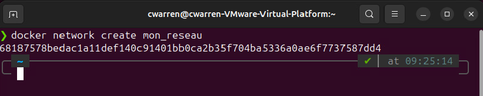

# ISS_TP2_Docker

## Date : `06-07-2025`
## Auteur : `Charles-Philippe Warren`
## Contexte : `Création d'un conteneur à partir d'un descriptif et installation d'un système de conteneurs.`

## Objectifs

    Analyser les différents scénarios de déploiement proposés dans les documents de conception.
    Distinguer correctement les services à installer sur les serveurs.
    Distinguer correctement les services à installer sur le réseau.
    Déterminer un plan des étapes à entreprendre pour installer et configurer les services réseau
    Configurer le système d’exploitation après l’installation.
    Installer des périphériques/composantes pour une connectivité au réseau.
    Configurer des périphériques / composantes pour une connectivité au réseau.
    Utiliser des protocoles sécuritaires.

### Réalisation: 
    Installation d'un système de conteneur selon la procédure et les recommandations du manufacturier;
    Configuration d'un système de conteneurs sécuritaire;
    Vérification du bon fonctionnent de chaque éléments du système de conteneurs;
    Configuration des règles de gestions et d'accès.

# Section 1 : Vérification et conteneurs

## Étape 1: Vérification de l’installation
    Après installation de docker et docker compose ouvrir un terminal bash et faire les commandes suivantes afin de valider si l'installation est conforme: 

    Vérification de la version installée de Docker:
```bash
    docker --version
```
---

---
    Vérification de la version installée de Docker Compose:
```bash
    docker compose version
```
---

---

## Étape 2 : Création de conteneurs sur le poste local
    Créer un réseau virtuel privé Docker appellé : mon_reseau.
```bash
    docker network create mon_reseau
```
---

---
    Vérification de la création du réseau viturel privé
```bash
    docker network ls
```
---

---
    Créer un conteneur Appache à partir de l'image http:latest
```bash
    docker run -d --name apache --network mon_reseau -p 8080:80 httpd:latest
```
---

---
    Vérification de la création du conteneur apache
```bash
    docker ps
```
---

---
