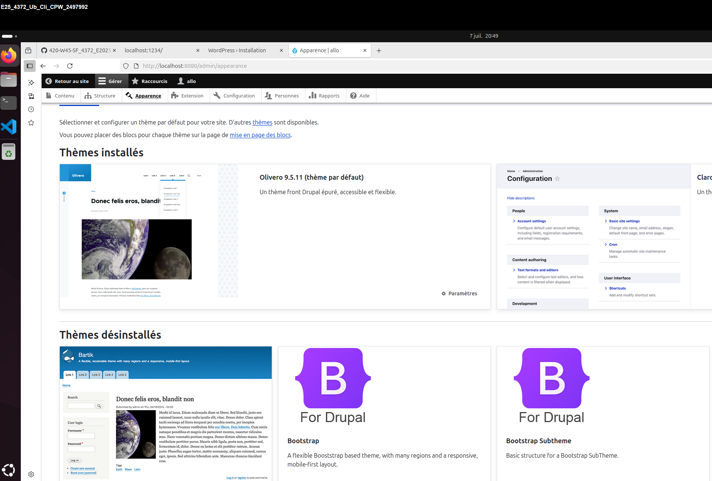

# ISS_TP2_Docker

## Date : `06-07-2025`
## Auteur : `Charles-Philippe Warren`
## Contexte : `Création d'un conteneur à partir d'un descriptif et installation d'un système de conteneurs.`

# Section 2 : Construction d'une image personnalisée Drupal

## Création de la structure des dossiers et fichier

```bash
mkdir -p mon_drupal/drupal
cd mon_drupal
touch README.md
```
## Création Dockerfile
```bash
touch Dockerfile
nano Dockerfile
```
```bash
FROM drupal:9

RUN apt update && apt install -y git \
  && rm -rf /var/lib/apt/lists/*

WORKDIR /var/www/html/themes

RUN git clone --branch 5.0.x --single-branch --depth 1 https://git.drupalcode.org/project/bootstrap.git \
  && chown -R www-data:www-data bootstrap

WORKDIR /var/www/html
```
## Création d'un réseau Docker
```bash
docker network create reseau_drupal
```
## Création d'un volume pour PostgreSQL
```bash
docker volume create drupal-data
```
## Lancer le conteneur PostgreSQL
```bash
docker run -d --name postgres --network reseau_drupal \
-e POSTGRES_USER=adminDrupal \
-e POSTGRES_PASSWORD=EncoreUneAutreBDDrupal \
-e POSTGRES_DB=bdDrupal \
-v drupal-data:/var/lib/postgresql/data \
postgres
```
## Lancer le conteneur PostgreSQL
```bash
docker build -t mon_drupal ./drupal
```
## Lancer le conteneur Drupal
```bash
docker run -d --name drupal --network reseau_drupal -p 8080:80 mon_drupal
```

##  Capture d’écran Drupal avec le thème Bootstrap.
---

---
